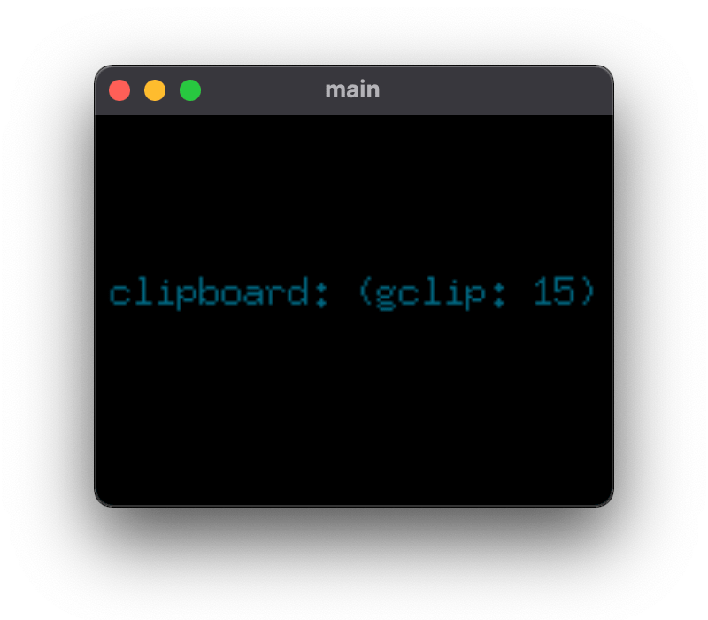
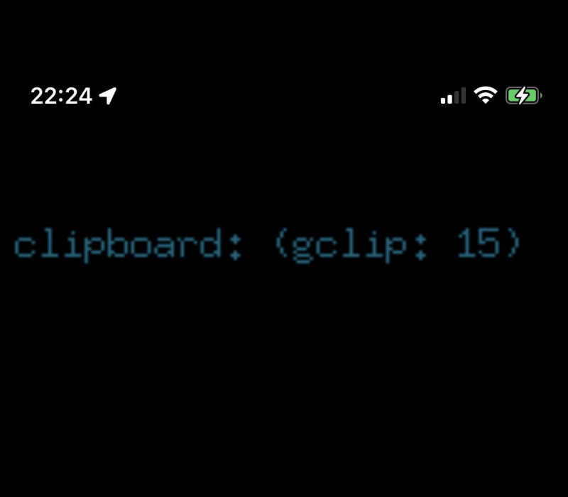
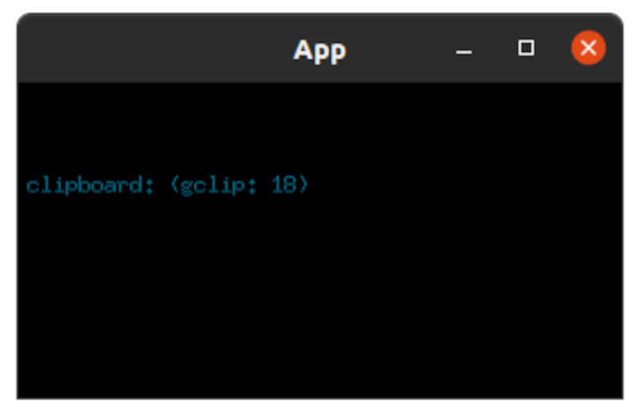

# gclip-gui

This is a very basic example for verification purpose that demonstrates
how the [golang.design/x/clipboard](https://golang.design/x/clipboard)
can interact with macOS/Linux/Windows/Android/iOS system clipboard.

The gclip GUI application writes a string to the system clipboard
periodically then reads it back and renders it if possible.

Because of the system limitation, on mobile devices, only string data is
supported at the moment. Hence, one must use clipboard.FmtText. Other supplied
formats result in a panic.

This example is intentded as cross platform application. To build it, one
must use [gomobile](https://golang.org/x/mobile). You may follow the instructions
provided in the [GoMobile wiki](https://github.com/golang/go/wiki/Mobile) page.

- For desktop: `go build -o gclip-gui`
- For Android: `gomobile build -v -target=android -o gclip-gui.apk`
- For iOS:     `gomobile build -v -target=ios -bundleid design.golang.gclip-gui.app`

## Screenshots

| macOS | iOS | Windows | Android | Linux |
|:-----:|:---:|:-------:|:-------:|:-----:|
||||||

## License

MIT | &copy; 2021 The golang.design Initiative Authors, written by [Changkun Ou](https://changkun.de).