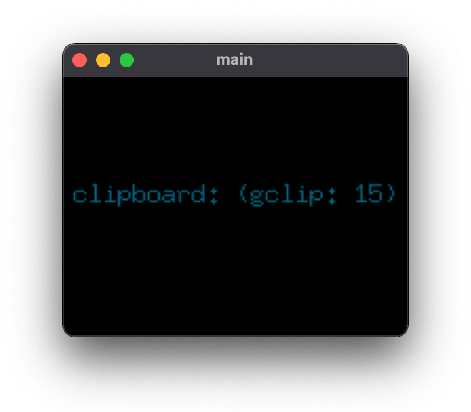
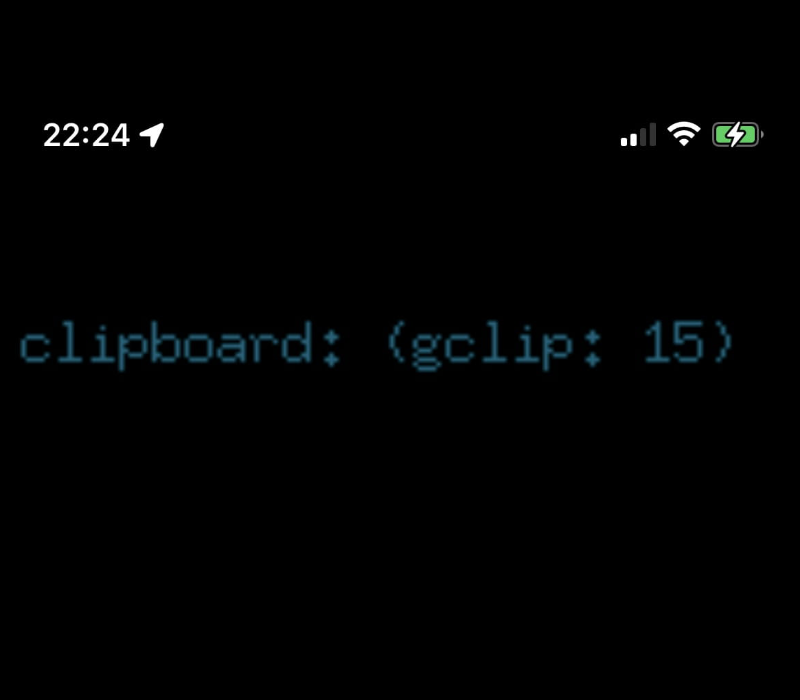
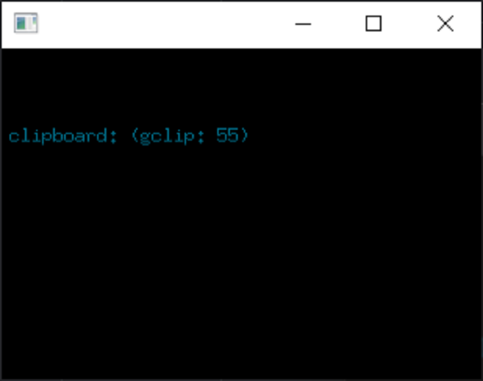
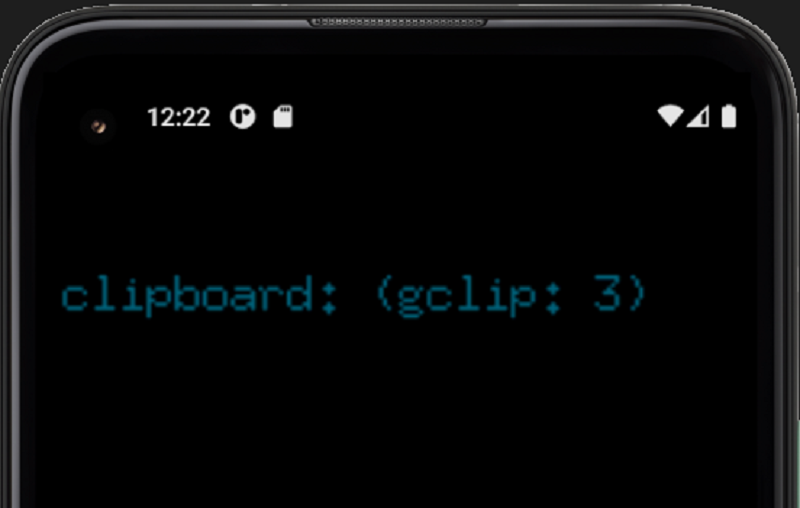
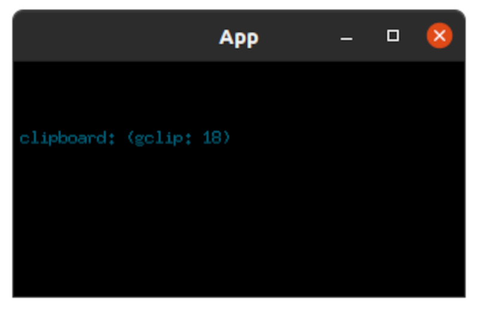

# gclip-gui

A small demo app for checking that
[golang.design/x/clipboard](https://golang.design/x/clipboard) works with the
system clipboard on macOS, Linux, Windows, Android and iOS.

Every second it writes a string to the clipboard, reads it back, and shows
what it read.

On iOS and Android only text is supported, so the app uses `clipboard.FmtText`;
other formats return `ErrUnsupported` there.

It is built with [gomobile](https://golang.org/x/mobile). To set that up, see
the [Go Mobile wiki](https://github.com/golang/go/wiki/Mobile).

- For desktop: `go build -o gclip-gui`
- For Android: `gomobile build -v -target=android -o gclip-gui.apk`
- For iOS:     `gomobile build -v -target=ios -bundleid design.golang.gclip-gui.app`

## Screenshots

| macOS | iOS | Windows | Android | Linux |
|:-----:|:---:|:-------:|:-------:|:-----:|
||||||

## License

MIT | &copy; 2021 The golang.design Initiative Authors, written by [Changkun Ou](https://changkun.de).